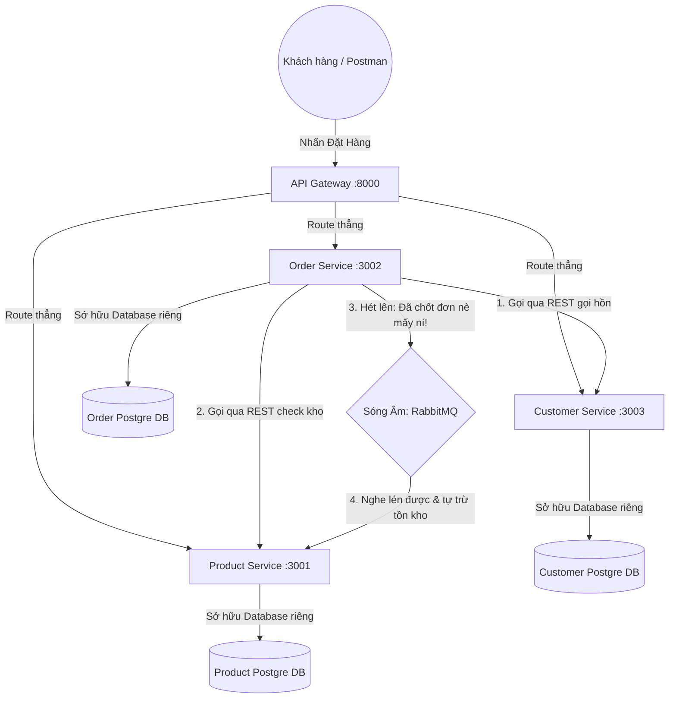

# HƯỚNG DẪN THỰC HÀNH KIẾN TRÚC PHẦN MỀM (TUẦN 06)

Đây là toàn bộ 5 bài tập thực hành về Kiến trúc phần mềm, Docker, Database Partitioning, Service-Based Architecture, và Event Architecture. Tất cả đều sử dụng **Node.js, Express, PostgreSQL và Docker Compose** giúp bạn dễ dàng chạy và test.

---

## 🚀 CÁCH KHỞI CHẠY TỪNG BÀI

Để chạy bất kỳ bài nào, bạn cần đảm bảo máy tính đã cài đặt **Docker** và **Docker Compose**.

Mở Terminal tại thư mục `tuan06` và thực hiện theo từng bước bên dưới. (Sau khi test xong 1 bài, bạn bấm `Ctrl+C` và gõ `docker compose down` để dọn dẹp trước khi sang bài tiếp theo).

### BÀI 1: Docker Image Optimization & Docker Compose (20 phút)

> **Mục tiêu:** Hiểu rõ các lệnh trong Dockerfile (CMD, ENTRYPOINT, RUN, COPY...), Multistage Build, Volume, Network.

- Khởi chạy:

  ```bash
  cd bai1_docker
  docker-compose -f docker-compose.optimized.yml up --build

  ```

- Xem kết quả:
  - Mở web: [http://localhost:3001/](http://localhost:3001/) (Danh sách users)
  - Xem lý thuyết Docker: [http://localhost:3001/docker-info](http://localhost:3001/docker-info)
- File đáng chú ý: Xem file `Dockerfile.optimized` và code `src/index.js` để đọc giải thích chi tiết.

### BÀI 2: Database Partitioning - SQL Server -> Postgres (20 phút)

> **Mục tiêu:** Thực hành chia Database theo 3 chiến lược: Horizontal, Vertical, Functional. Demo qua logic code tự động route.

- Khởi chạy:
  ```bash
  cd bai2_db_partition
  docker-compose up --build
  ```
- Xem kết quả: Mở [http://localhost:3002/](http://localhost:3002/) để xem danh sách API và lý thuyết.
- Các API để test (có thể dùng Postman hoặc trình duyệt):
  - Horizontal: [http://localhost:3002/horizontal?gender=Nam](http://localhost:3002/horizontal?gender=Nam)
  - Vertical: [http://localhost:3002/vertical/basic](http://localhost:3002/vertical/basic) (Chỉ data cơ bản) & `/vertical/full/1` (Full data + join)
  - Functional: [http://localhost:3002/functional/report](http://localhost:3002/functional/report)

### BÀI 3: Monolith -> Service-Based Architecture

> **Mục tiêu:** Chuyển đổi từ ứng dụng Monolith (tất cả code chung 1 app) sang SBA (nhiều service chạy riêng biệt như User, Product, Order nhưng trỏ chung 1 Database).

- **Chạy bản Monolith:**

  ```bash
  cd bai3_sba/mono
  docker-compose up --build
  ```

  - App chạy tại: [http://localhost:3003](http://localhost:3003) (Chứa API Users, Products, Orders).

- **Chạy bản SBA (Service-Based Architecture):**
  _(Dừng bản monolith trước khi chạy)_

  ```bash
  cd ../sba
  docker-compose up --build
  ```

  - User Service: [http://localhost:3004/users](http://localhost:3004/users)
  - Product Service: [http://localhost:3005/products](http://localhost:3005/products)
  - Order Service: [http://localhost:3006/orders](http://localhost:3006/orders) (Đây là service phức tạp vì nó gọi sang User & Product qua HTTP)

### BÀI 4: Event Choreography vs Orchestration

> **Mục tiêu:** So sánh 2 mô hình kiến trúc giao tiếp khi thực hiện một quy trình phức tạp (Đặt đồ ăn).

- **Mô hình Event Choreography (Bưu điện - Fire and Forget):**

  ```bash
  cd bai4_events/choreography
  docker-compose up --build
  ```

  - Test đặt hàng: Gửi POST request tới `http://localhost:4002/orders`

    ````json

    {
    "user_id": 1,
    "item": "Trà sữa Phúc Long size Khổng lồ",
    "amount": 75000
    }

        ```

    ````

  - Xem logs Event Bus qua: [http://localhost:4001/events](http://localhost:4001/events)

- **Mô hình Orchestration (Nhạc trưởng điều phối tập trung):**
  _(Dừng choreography trước nhé)_

  ```bash
  cd ../orchestration
  docker-compose up --build
  ```

  - Orchestrator đóng vai trò nhận lệnh tại `http://localhost:4005/place-order`. Gửi POST y hệt như trên.
  - Xem logs hoạt động "Nhạc Trưởng": [http://localhost:4005/workflows](http://localhost:4005/workflows)

### BÀI 5: Đồ án thực tế - Online Food Delivery App (Mono & SBA)

> **Mục tiêu:** Dùng các kiến thức đã học ghép thành 1 project nhỏ quản lý Food Delivery trọn vẹn, chạy thực tế.

- **Bản Monolithic:**

  ```bash
  cd bai5_food_delivery/mono
  docker-compose up --build
  ```

  - Web chính: [http://localhost:5001/](http://localhost:5001/) (Chứa DB users, menu món ăn, hóa đơn). Chạy vào xem menu API và docs.

- **Bản SBA:**
  _(Dừng bản monolith trước khi chạy)_

  ```bash
  cd ../sba
  docker-compose up --build
  ```

  - Ở bản SBA, ứng dụng tách ra:
    - User Service: `http://localhost:5002`
    - Menu Service: `http://localhost:5003`
    - Order Service: `http://localhost:5004` (Sẽ gửi HTTP request qua 2 service trên để validate user có tồn tại và món ăn còn hàng không trước khi ghi vào Database dùng chung).

### BÀI 6: Microservices Architecture (REST & Message Broker)

> **Mục tiêu:** Xây dựng hệ thống Microservices chuẩn mực siêu cấp VIP pro. Mỗi Service có một Database riêng hoàn toàn không đụng vào nhau. Giao tiếp đồng bộ để check thông tin qua REST, và giao tiếp bất đồng bộ qua RabbitMQ Message Broker.

#### Sơ đồ hoạt động:



#### Cách chạy hệ thống:
_ gõ lệnh `docker-compose down -v` trước cho sạch sẽ càng tốt)_
```bash
cd bai6_microservices
docker-compose up --build
```

#### Hướng dẫn test hệ thống :

**Bước 1: Soi kho hàng có gì?**
Cổng 8000 (API Gateway) giống như bác bảo vệ đứng gác, ổng sẽ tự biết đường chỉ bạn tới cái kho rẽ hướng nào. Mình test bằng postman hoặc chorme gõ:
 `GET http://localhost:8000/api/products`
Bạn sẽ thấy data `Laptop Gaming X` với số hàng tồn kho (`stock`) là **10**.

**Bước 2: Quẹt thẻ mua hàng nàooooo!**
Mở Tab mới ở Postman, chọn **POST**, dán đường link:
 `POST http://localhost:8000/api/orders`
Chuyển qua tab Body -> raw -> JSON và dán lệnh sau để chốt 2 con Laptop:
```json
{
  "customer_id": 1,
  "product_id": 1,
  "quantity": 2
}
```
Nhấn SEND !

**Chuyện bí mật gì vừa diễn ra ?**
1. Gói hàng bay vào **API Gateway**, anh bảo vệ quẳng thẳng tay nó sang **Order Service**.
2. **Order Service** dùng `REST` gọi ké sang nhà thằng **Customer Service** lấy danh tính khách hàng: "Ê khách VIP tên Nguyễn Văn A đúng khum?". 
3. Giữ máy tí, **Order Service** lại móc điện thoại gọi tiếp qua **Product Service** kho: "Ê Laptop còn lấy 2 cái nha!?". Mọi thứ okee, nó mới lưu vô Database của nó!
4. Order xong, thay vì kêu thằng Product trừ kho, nó lười quá bèn dùng máy phóng thanh hét vang lên kênh chung **RabbitMQ**: "Ê tui chốt đơn thằng khách A mua cái #1 rồi nha mấy ní!!".
5. Bất thình lình, **Product Service** lúc đó đang rảnh, nghe được câu hét, lẳng lặng lủi vô DB của mình và tự trừ tồn kho của Laptop đi 2 cái cái rụp!

**Bước 3: Xác minh sự diệu kỳ**
Bạn chỉ việc gõ `GET http://localhost:8000/api/products` một mạng nữa.
Bùm! Tồn kho (`stock`) bây giờ còn đúng **8**. Hai service trừ nhau mà tụi nó không hề vất vả gọi API của nhau một dòng code nào cả! Chúc bạn được 10 điểm tuyệt đối nha! 
